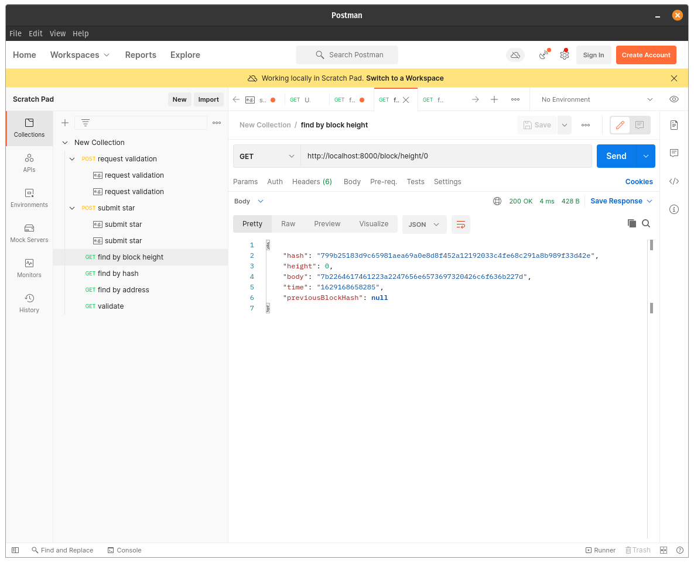
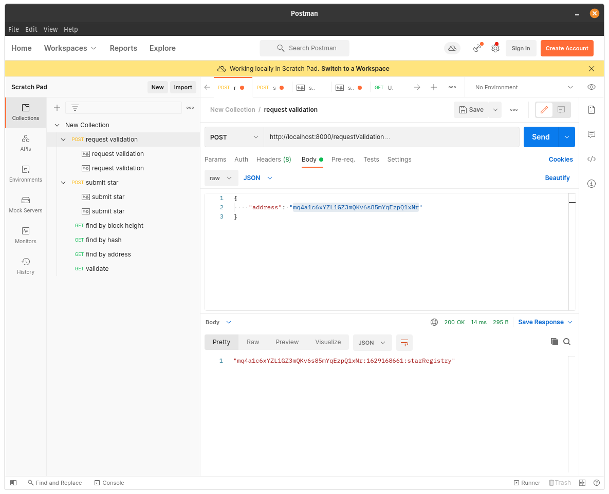
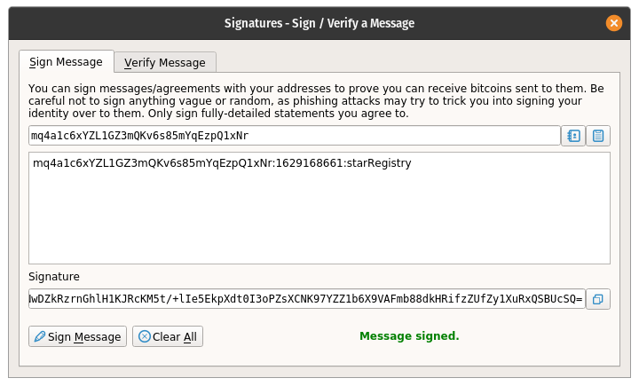
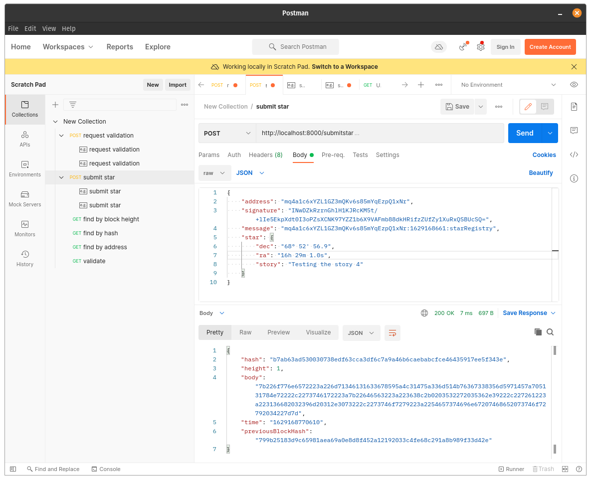
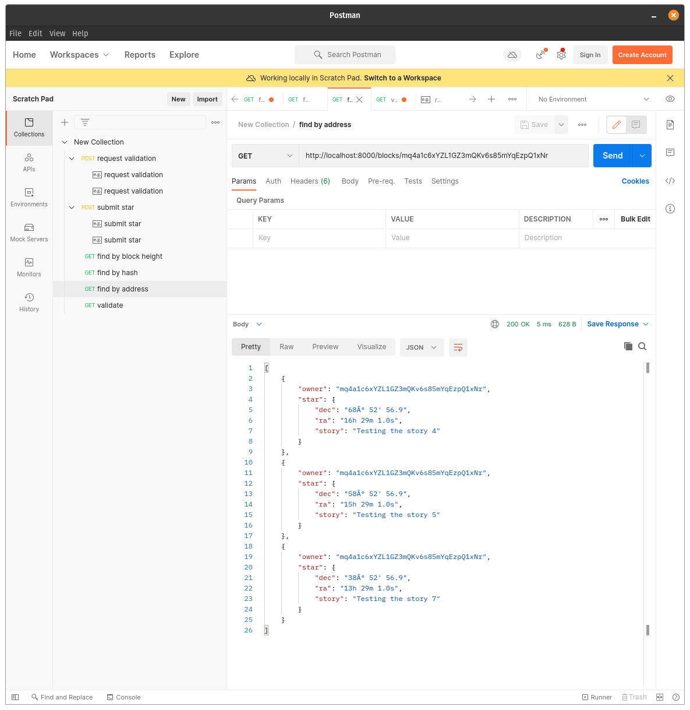

# Project 1: Create Your Own Private Blockchain

## Using GET call to request the Genesis block

## Using POST call to requestValidation

## Signing message with my wallet

## Submitting my star

## Using GET call to retrieve stars owned by my address

